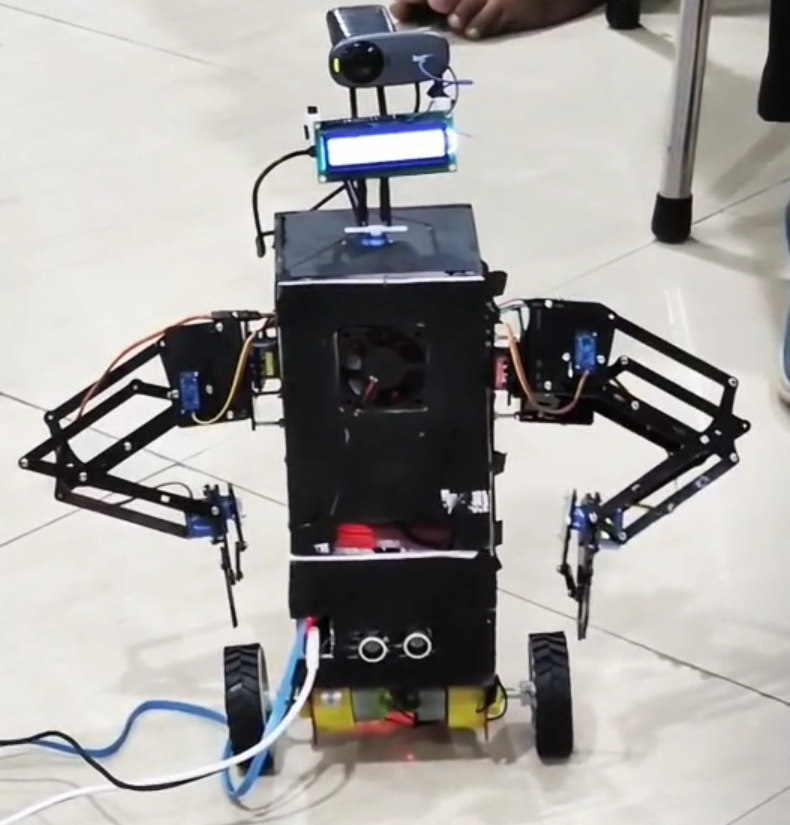

# VisionRover

VisionRover is an AI-powered robotic platform that integrates computer vision, speech interaction, face recognition, persistent memory management, and embedded hardware control into a unified edge-computing system.

The project was designed and developed as a complete robotics platform capable of real-time environmental perception, voice-based interaction, autonomous object search, and intelligent decision-making while operating on resource-constrained hardware. VisionRover has been successfully deployed on a Raspberry Pi 3 B+, demonstrating efficient software architecture and memory management without requiring dedicated AI acceleration hardware.

---



---

## Core Capabilities

### Computer Vision

* Real-time object detection using YOLO
* Multi-object recognition
* Environmental scanning
* Object localization and tracking
* Servo-assisted panoramic vision

### Face Recognition

* Face detection
* Persistent facial identity storage
* User recognition
* Personalized greeting system

### Speech Interaction

* Speech-to-Text (STT)
* Text-to-Speech (TTS)
* Voice command processing
* Conversational responses

### Autonomous Search

* Target object search
* Environmental scanning
* Dynamic camera positioning
* Autonomous target localization

### Embedded Control

* ESP32-based hardware control
* Motor control
* Servo control
* Serial communication architecture

### Persistent Memory Management

* Object caching
* State persistence
* Runtime memory optimization
* Automatic cleanup of stale data
* Configuration persistence

---

## System Architecture

```text
                    ┌────────────────────┐
                    │     User Input     │
                    │ Voice / Commands   │
                    └──────────┬─────────┘
                               │
                               ▼
                    ┌────────────────────┐
                    │   Raspberry Pi     │
                    │  Main AI Engine    │
                    └──────────┬─────────┘
                               │
        ┌──────────────────────┼──────────────────────┐
        ▼                      ▼                      ▼

┌──────────────┐    ┌────────────────┐    ┌──────────────┐
│ Computer     │    │ Speech Engine  │    │ Decision     │
│ Vision       │    │ STT / TTS      │    │ Layer        │
└──────────────┘    └────────────────┘    └──────────────┘

                               │
                               ▼

                    ┌────────────────────┐
                    │       ESP32        │
                    │ Hardware Controller│
                    └──────────┬─────────┘
                               │
               ┌───────────────┼───────────────┐
               ▼               ▼               ▼

           Motors          Servos         Sensors
````

---

## Resource-Efficient Design

VisionRover was engineered with a strong emphasis on computational efficiency and low resource consumption.

The software architecture enables simultaneous execution of:

* Real-time object detection
* Face recognition
* Speech processing
* Autonomous search behaviors
* Hardware communication
* Persistent memory management

while maintaining stable operation on a Raspberry Pi 3 B+.

Optimization techniques include:

* Lightweight module design
* JSON-based persistent storage
* Object caching
* Controlled background processing
* Automatic stale-data cleanup
* Efficient serial communication

---

## Face Registration

Before using facial recognition features, a user must first register their face within the system.

Run:

```bash
python train_faces.py
```

The generated facial encodings are stored for future identification.

This process only needs to be repeated when adding new users or updating facial data.

---

## Technology Stack

### Languages

* Python
* C++
* Kotlin

### AI and Computer Vision

* YOLO
* OpenCV
* Face Recognition

### Communication

* Serial Communication
* ESP32 Integration

### Speech Processing

* Edge-TTS
* Speech Recognition

---

## Project Structure

```text
VisionRover/
│
├── app.py
├── find.py
├── internet.py
├── motor.py
├── personality.py
├── robot_state.py
├── servo.py
├── smallFaces.py
├── speak.py
├── train_faces.py
├── upperNode.py
│
├── object_cache.json
├── node_ports.json
├── yolo11n.pt
│
├── base_controller/
│   └── base_controller.ino
│
├── upper_controller_direct/
│   └── upper_controller_direct.ino
│
└── upper_controller_pca/
    └── upper_controller_pca.ino
```

## Installation

Clone the repository:

```bash
git clone https://github.com/Sujit-Hiwale/VisionRover.git
cd VisionRover
```

Install dependencies:

```bash
pip install -r requirements.txt
```

Register a face (optional but recommended):

```bash
python train_faces.py
```

Start VisionRover:

```bash
python app.py
```

---

## Companion Android Application

An optional Android application is available for sending commands to VisionRover from a mobile device.

Repository:
https://github.com/Sujit-Hiwale/NLP-Audio-Transmitter

---
## Applications

* Intelligent Robotics
* Human-Robot Interaction
* Computer Vision Research
* Embedded AI Systems
* Educational Robotics
* Autonomous Systems Research
